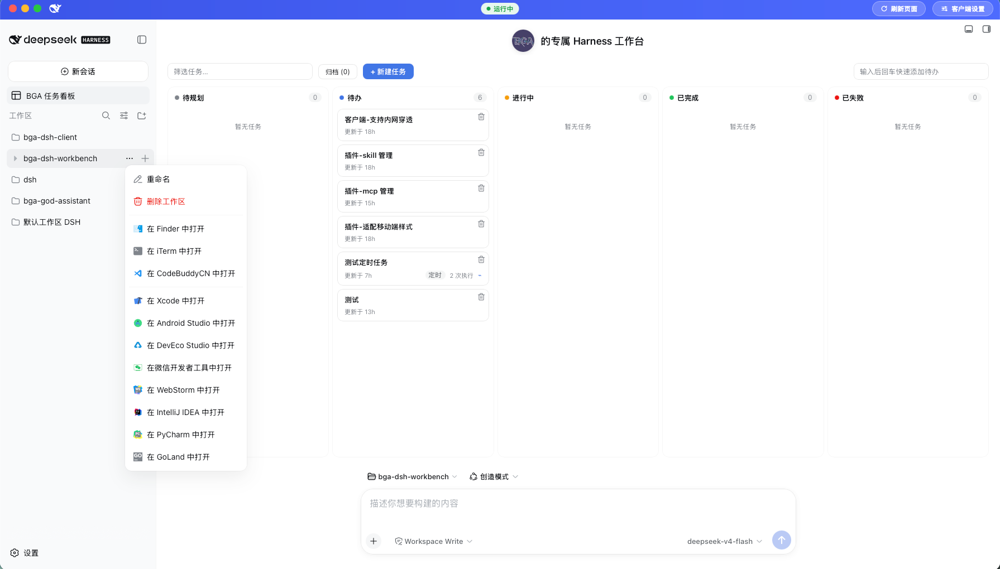
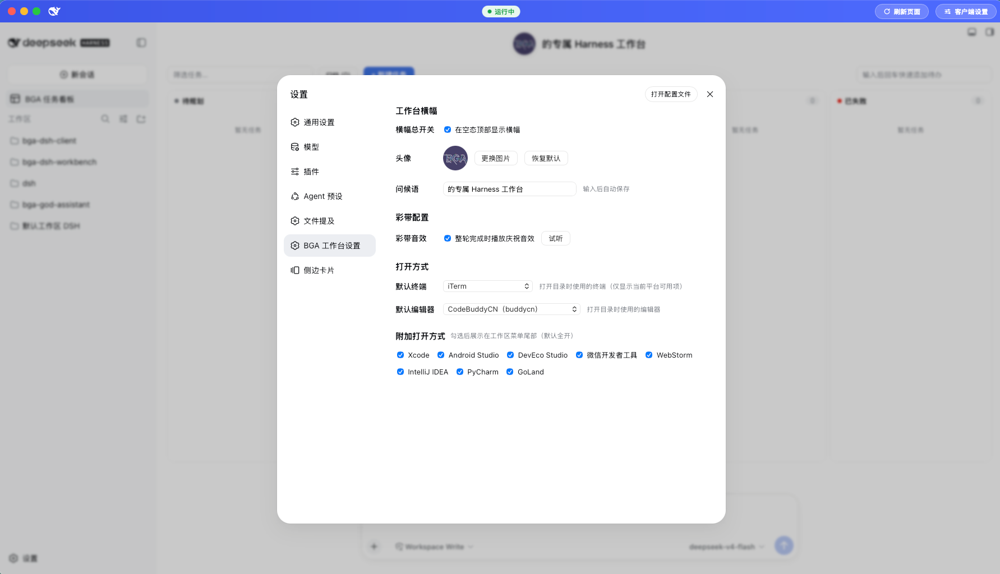

# DeepSeek Harness Personal Workbench Plugin

[](LICENSE)
[](https://www.npmjs.com/package/bga-dsh-workbench)
[](https://www.npmjs.com/package/bga-dsh-workbench)

A personal workbench plugin customized for [DeepSeek Harness](https://github.com/deepseek-ai/deepseek-harness): it shows a personalized banner with an avatar at the top of the hero empty state, plays a confetti animation when a chat turn completes, and ships a built-in task board that can drive agent sessions to execute tasks.




## Features

### 🎉 Personalized Banner (Hero Banner)

- Displays a workbench banner at the top of the hero empty state on the Harness web interface.
- Customizable:
  - **Greeting text**: defaults to "的 Harness 工作台" (Harness Workbench). You can change it to anything, e.g. "张三的 Harness 工作台" (Zhang San's Harness Workbench).
  - **Avatar image**: upload a local image as the banner avatar; if left empty, a built-in default avatar is used. Supported formats are PNG / JPG / GIF / WebP; the backend sniffs the type and persists it to the storage directory.
  - **Visibility toggle**: hide the banner at any time.
- Configuration is persisted under the "Workbench Settings" namespace and takes effect immediately after editing on the settings page.

### 🎊 Turn-Complete Celebration (Confetti)

- Whenever a chat turn completes, the front end automatically plays a confetti animation.
- Optional **celebration sound** toggle (on by default).

### 📋 Built-in Task Board

- Provides a "Task Board" entry in the sidebar, managing tasks in a multi-column kanban layout.
- Tasks can be **actually executed** — driving an agent session to complete them. The execution target can be pinned to:
  - a workspace;
  - a mode (agent preset);
  - a permission level (`read-only` / `workspace-write` / `danger-full-access`; falls back to the runtime default when omitted).
- Supports **5-field cron scheduling** (e.g. `0 23 * * *` runs every day at 23:00).
- Task data is persisted by the host to the storage directory (`tasks.json`).
- Limitations:
  - Scheduling runs in the browser, so the GUI tab must stay open; a missed run is skipped and never backfilled.
  - Execution consumes API quota.
- The plugin injects task-board usage guidance into the agent's system prompt, so when you mention "task board / kanban / scheduled task", the agent can collaborate accordingly.

## Task Board Credits

The "Task Board" feature of this plugin is a **customized derivative** of the [`packages/dsh-task-board`](https://github.com/zhu1090093659/dsh-web-ui/tree/main/packages/dsh-task-board) sub-package from the open-source project [`zhu1090093659/dsh-web-ui`](https://github.com/zhu1090093659/dsh-web-ui).

- **Upstream project**: `dsh-task-board` — a hot-pluggable DeepSeek Harness (DSH) Web GUI task board plugin, featuring a Host-authoritative ledger, real DSH session execution, and Host-side 5-field cron scheduling. It is mounted through `cordis.patch.yml` and the profile mechanism without modifying DSH source code.
- **Customizations in this plugin**: while reusing its task-board core (multi-column kanban, Host-authoritative `tasks.json` ledger, real session execution, 5-field cron scheduling, system-prompt injection), this plugin integrates the workbench banner and turn-complete confetti, and unifies everything under the "Workbench Settings" namespace and host wiring.
- **License**: governed by the `LICENSE` file in the upstream `packages/dsh-task-board` directory; use and distribute in accordance with its open-source terms.

## For End Users

If you just want to install and use this plugin, you don't need to build from source.

### Install (via the DSH plugin mechanism)

This plugin is distributed as a DSH plugin package. In an environment where DeepSeek Harness is already installed, add it to your profile using the `dsh` CLI:

```bash
# Install from npm (after publishing)
dsh plugin --profile <your profile name> add bga-dsh-workbench

# Or install from a Git repository
dsh plugin --profile <your profile name> add github:bingoogolapple/bga-dsh-workbench

# Or install from a local path (for development/debugging)
dsh plugin --profile <your profile name> add /path/to/bga-dsh-workbench
```

> After installation, restart the DSH service (or the corresponding profile) for the banner, task board, and other capabilities to take effect.

### Usage

1. Open the Harness web interface and configure the banner text, avatar, and confetti sound under the "Workbench" group on the settings page.
2. Enter the board from the sidebar "Task Board" entry, create and manage your tasks; enable scheduled execution when needed.
3. Collaborate with the "Task Board" in the chat, letting the agent help you manage and execute tasks.

## For Maintainers

If you are a repository maintainer or want to modify and rebuild from source yourself, read on.

### Directory Structure

```
bga-dsh-workbench/
├── images/                       # README screenshot assets
│   ├── bga-dsh-workbench-main.png   # main screen
│   └── bga-dsh-workbench-settings.png  # settings page
├── src/                          # source code
│   ├── index.ts                  # Host entry: wires up banner / routes / task board
│   ├── routes.ts                 # HTTP routes: banner avatar / config / settings / task persistence
│   ├── settings.ts               # "Workbench Settings" namespace and schema
│   ├── task-board-host.ts        # injects task-board guidance into the agent system prompt
│   ├── open-app.ts               # "Open with" logic (terminal / editor / extra IDEs)
│   ├── core/                     # task board storage and other core logic
│   └── client/                   # browser-side (Client): banner, task board UI, settings section, etc.
├── lib/                          # build output (esbuild bundle + tsc type declarations), shipped with the package
├── build.mjs                     # build script: produces lib/index.js (host) and lib/client.js (browser)
├── cordis.patch.yml              # Cordis composition patch: plugs the plugin into the host composition
├── dsh.plugin.json               # plugin manifest (entry, injections, client platform)
├── package.json                  # dependencies and scripts
├── tsconfig.json                 # TypeScript config (with declaration output)
├── vitest.config.ts              # test config
├── pnpm-lock.yaml                # pnpm dependency lock
├── pnpm-workspace.yaml
├── LICENSE                       # MIT License
└── README.zh-CN.md
```

### Build from Source

Prerequisites: Node.js ≥ 22.19, pnpm, and a local `../deepseek-harness` (devDependencies reference it via `link:`).

```bash
pnpm install          # install dependencies (devDeps linked to local deepseek-harness)
pnpm typecheck       # tsc --noEmit type checking
pnpm test            # vitest runs the unit tests (currently 129 cases)
pnpm build           # run build.mjs: produces host/browser output and type declarations under lib/
pnpm check           # runs typecheck + test + build in sequence
```

> The `prepack` script automatically runs `pnpm build` before `pnpm publish`, ensuring the published `lib/` is up to date.

### Local Debugging

During development you can install from a local path into your DSH profile:

```bash
dsh plugin --profile <your profile name> add .
```

After editing the source, run `pnpm build` again and restart the DSH service for the corresponding profile to load the latest output.

### Packaging and Publishing

1. Make sure the `files` field in `package.json` (which includes `lib`, `dsh.plugin.json`, `cordis.patch.yml`, `LICENSE`, `README.md`, `README.zh-CN.md`) matches the actual artifacts; run `pnpm build` locally to generate `lib/` before publishing.
2. Tag a version and push, for example:

   ```bash
   git tag v0.0.1
   git push origin v0.0.1
   ```

3. Users can then install via `dsh plugin --profile <profile> add bga-dsh-workbench` (npm) or `add github:bingoogolapple/bga-dsh-workbench` (Git).

## Support the Author

* The author's main coding plan is [OpenCode Go](https://opencode.ai/go?ref=8CYK5082AG), a cloud subscription (OpenCode Go) built on the open-source [opencode.ai](https://opencode.ai/go?ref=8CYK5082AG). By subscribing through the author's referral link [Subscribe to OpenCode Go](https://opencode.ai/go?ref=8CYK5082AG), **both you and the author get $5 of subscription credit** — feel free to support the author through this link. Thank you!

OpenCode Go includes the following usage credit limits, so using cheaper models almost never causes token anxiety:

- 5-hour limit — $12 of usage credit
- Weekly limit — $30 of usage credit
- Monthly limit — $60 of usage credit

## Recommended Projects by the Author

* You are welcome to try the author's first indie software product, the [God Assistant browser extension / plugin development platform](https://github.com/bingoogolapple/bga-god-assistant-config).
* You are also welcome to check out the author's other DSH project, the [DSH Desktop Client (bga-dsh-client)](https://github.com/bingoogolapple/bga-dsh-client): a Tauri 2 based DeepSeek Harness desktop client offering menu bar, tray, window management, and config import/export, runnable standalone or alongside the gateway.

## License

This project is open-sourced under the [MIT License](LICENSE) and can be freely used, modified, and distributed.
