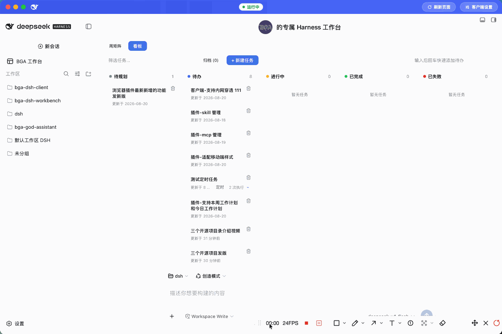

# DeepSeek Harness 个人工作台插件

[](LICENSE)
[](https://www.npmjs.com/package/bga-dsh-workbench)
[](https://www.npmjs.com/package/bga-dsh-workbench)
[](https://www.npmjs.com/package/@deepseek-ai/dsh?activeTab=versions)

[English](README.en.md) | 中文

一个为 [DeepSeek Harness](https://github.com/deepseek-ai/deepseek-harness) 定制的个人工作台插件：空态页顶部展示可自定义的横幅与头像；一轮对话完成时，按你设定的配色、强度与时机撒彩带庆祝，并可顺势开启一组外语随堂测（默认 1 道，可调 1–10；内置 CEFR 分级词库或由模型按主题生成，配心形 / 连击 / 段位与错词本）；内置「任务看板」提供周矩阵与五列看板两种视图，既能当随手待办，也能把任务真正交给 agent 执行并支持 cron 定时；还能一键用本机终端、编辑器或 Xcode / Android Studio 等应用打开工作区目录。全部数据落在宿主本地存储目录，无需自建后端。



## 功能介绍

### 🎉 个性化横幅（Hero Banner）

- 在 Harness Web 界面的空态顶部展示一条工作台横幅，开启后会自动隐藏 Harness 默认的「探索未至之境」头条文案，避免两者重叠。
- 可自定义：
  - **问候语文本**：默认「的专属 Harness 工作台」，可改成任意文案（如「张三的专属 Harness 工作台」）。
  - **头像图片**：可上传本地图片作为横幅头像，留空则使用内置默认头像；支持的格式为 PNG / JPG / GIF / WebP，由后端嗅探类型后落盘到存储目录。
  - **显示开关**：随时关闭横幅。
- 配置通过「工作台设置」命名空间持久化，可在设置页直接修改并即时生效。

### 🎊 完成回合庆祝（Confetti）

- 每当一轮对话完成，页面自动播放撒彩带动画，给开发过程加点仪式感。
- 可自定义（全部在设置页调整）：
  - **庆祝音效**：开关 + 「试听」按钮（默认开启）；
  - **配色主题**：默认 / 金色 / 海洋 / 樱花 / 霓虹；
  - **强度**：小 / 中 / 大 / 超大；
  - **触发时机**：仅成功时 / 每轮对话 / 仅任务执行（选「仅任务执行」后，普通对话不再撒彩带）。

### 🧠 外语学习（多邻国式微学习）

- **随彩带一起触发**：一轮对话完成放彩带的同时（配置了话题卡时）弹出一道小题，学习节奏可调：
  - **学习频率**：每轮对话后 / 每 2 轮后 / 每 5 轮后 / 每 10 轮后 / 仅手动触发；
  - **每日答题上限**：防止刷题过度（设 0 表示不限）。
- **话题卡片**：每套词库是一张卡，多张卡并存，你**手动选择当天学哪张卡**（选择会持久化）。
- **词库来源**：
  - **内置 CEFR 分级词库（A1–C2）**——一键选用，无需模型生成；
  - **模型按主题生成**——输入主题，直接调用你当前选择的模型生成约 20 条学习内容（单词 + 实用句子各约 10 条，含释义与例句），并落盘本地缓存。
- **多语言支持**：学习目标语言可选英语（含适合初学者的简单英语）/ 日语 / 韩语 / 西语 / 法语 / 德语 / 葡语 / 俄语 / 阿语，释义（母语）语言也可选。
- **游戏化机制**（全部本地、无后端）：
  - ❤️ **心形**（每天 5 颗）：答错扣 1 颗，扣完当天该卡锁定；
  - 🔥 **连击**：连续活跃天数；
  - ⚡ **XP 与段位**（青铜→钻石）；
  - 🎓 **掌握**：已达标的词标记为已完成（不删除），不再出现在随机抽取中。
- **掌握规则**：每张卡可选「按次数（答对 N 次）」或「间隔重复 SRS」，每次答题数量也可调。
- **答题模式**：抄写 / 回忆（给释义填目标语言）/ 选择 / 听音拼写（本地 Web Speech 朗读）。
- **错词本**：答错的词自动进错词本，可查看、移除或一键清空，方便集中复习。
- **学习报告**：随时查看总经验值、连击天数、已掌握词数、错词数与正确率。
- **数据隐私**：全部进度持久化到宿主存储目录（`english-data.json`）；支持 **导出 / 导入 JSON** 以备份与迁移，**无需自建后端**。
- 当前卡全部掌握后，会弹出提示，引导你换一张话题卡或生成新主题。

### 📋 内置任务看板（Task Board）

- 在侧边栏提供「任务看板」入口，提供两种视图，随时切换：
  - **周矩阵**（默认主视图）：按「分类 × 周一到周日」排布本周任务，一目了然；
  - **五列看板**：待规划 / 待办 / 进行中 / 已完成 / 已失败，适合流水线式推进。
- **任务形态**分两种：
  - **轻量待办**：随手记录、手动打勾完成，适合琐事；
  - **可执行任务**：把任务**真实交给 agent 执行**——可钉定执行目标：
    - 工作区（workspace）；
    - 模式（agent 预设）；
    - 权限（只读 / 可写工作区 / 完全访问，缺省用运行时默认）。
- **定时执行**：支持 5 段 cron 表达式（如 `0 23 * * *` 每天 23 点），并内置「每天 09:00 / 每小时 / 每 10 分钟 / 每周一 09:00」等常用预设。
- **组织管理**：任务可设优先级（高 / 中 / 低）、分类与日期；新建时可从「快捷句式」一键填入常用标题模板。
- **好用的细节**：顶部搜索框按标题/描述筛选；「快速添加」框回车即建待办；已归档任务可随时恢复。
- **执行记录**：每个可执行任务都有执行历史，可回看当时生成的对话会话。
- **周矩阵增强**（把周计划当工作台用）：
  - **周起始日**：可设周一或周日开头；
  - **分类管理**：内置业务/技术需求、运维类、综合管理类、期望得到的支持四类，可增删自定义；
  - **每日打卡**：完成后可标记「当日日报已完成」；
  - **统计面板**：本周各分类任务量与完成率；
  - **日报提醒**：到点且当日未完成时横幅提醒；
  - **一键导出**：复制本周日报 / 单日日报 / 纯文本，或导出 JSON 备份。
- 任务数据由宿主持久化到存储目录（`tasks.json`）。
- 限制说明：
  - 定时调度在浏览器端，需要 GUI 标签页打开；错过即跳过，不会补跑。
  - 执行会消耗 API 额度。
- 插件会向 agent 的 system prompt 注入任务看板使用指引，使你提到「任务看板 / 看板 / 定时任务」时 agent 能据此协作。

### 🧭 打开方式（Open With）

- 在工作区列表里，每个工作区都带「打开」菜单，一键用本机应用打开对应目录：
  - **在 Finder 中打开**：调起系统文件管理器（Windows 为资源管理器，Linux 为文件管理器）；
  - **在终端中打开**：调起你的终端（可在设置页指定默认终端，如 iTerm / Windows Terminal / GNOME 终端 / Konsole / XFCE，缺省用系统默认）；
  - **在编辑器中打开**：调起你的编辑器（可在设置页指定默认编辑器，如 VS Code / Cursor / CodeBuddy / Trae / Qoder / CatPaw 等主流分支，缺省用系统默认）。
- **附加 IDE**（可选开关，默认全开）：菜单末尾还可追加「在 Xcode / Android Studio / DevEco Studio / 微信开发者工具 / WebStorm / IntelliJ IDEA / PyCharm / GoLand 中打开」，按需点亮即可。
- **贴心处理**：未安装的应用会自动跳过并回退到可用命令，不会报错打断你；微信开发者工具需要先在其「设置 → 安全 → 服务端口」开启端口，且目录为微信小程序工程时才能唤起。

## 任务看板来源说明

本插件的「任务看板」功能基于开源项目 [`zhu1090093659/dsh-web-ui`](https://github.com/zhu1090093659/dsh-web-ui) 下的子包 [`packages/dsh-task-board`](https://github.com/zhu1090093659/dsh-web-ui/tree/main/packages/dsh-task-board) **二次开发定制**而成。

- **上游项目**：`dsh-task-board` —— 一个可热插拔的 DeepSeek Harness（DSH）Web GUI 任务看板插件，具备 Host 权威账本、真实 DSH 会话执行、Host 端 5 段 cron 定时调度等能力，通过 `cordis.patch.yml` 与 profile 机制挂载，不改动 DSH 源码。
- **本插件定制点**：在沿用其任务看板核心（多列看板、Host 权威账本 `tasks.json`、真实会话执行、5 段 cron 调度、system prompt 注入）的基础上，叠加了本插件的**周矩阵主视图**（分类 × 周计划、每日打卡、统计面板、日报提醒、一键导出），并集成了工作台横幅、完成回合彩带与「打开方式」菜单，统一纳入「工作台设置」命名空间与宿主装配。
- **许可证**：请以上游仓库 `packages/dsh-task-board/LICENSE` 文件为准，遵循其开源协议使用与分发。

## 软件使用者

如果你只是想安装并使用这个插件，无需从源码构建。

### 安装（通过 DSH 插件机制）

本插件以 DSH 插件包的形式分发。在已安装 DeepSeek Harness 的环境中，使用 `dsh` CLI 将其加入你的 profile 即可：

```bash
# 从 npm 安装（发布后）
dsh plugin --profile <你的 profile 名> add bga-dsh-workbench

# 或从 Git 仓库安装
dsh plugin --profile <你的 profile 名> add github:bingoogolapple/bga-dsh-workbench

# 或本地路径安装（开发调试）
dsh plugin --profile <你的 profile 名> add /path/to/bga-dsh-workbench
```

> 安装后重启 DSH 服务（或相应 profile），横幅、任务看板等能力即生效。

### 使用

1. 打开 Harness Web 界面，在设置页的「工作台」分组中配置横幅文本、头像、彩带主题与音效、外语学习、打开方式偏好等。
2. 从侧边栏「任务看板」入口进入看板，用周矩阵或五列看板管理任务；需要时开启定时执行。
3. 在对话框中与「任务看板」协作，让 agent 帮你管理并执行任务。

## 软件维护者

如果你是仓库维护者或想基于源码自行修改、重新构建，请往下看。

### 目录结构

```
bga-dsh-workbench/
├── images/                       # README 截图素材
│   ├── bga-dsh-workbench-main.png   # 主界面
│   └── bga-dsh-workbench-settings.png  # 设置页
├── src/                          # 源码
│   ├── index.ts                  # 宿主端（Host）入口：装配横幅/路由/任务看板
│   ├── routes.ts                 # HTTP 路由：横幅头像/配置/设置/任务持久化
│   ├── settings.ts               # 「工作台设置」命名空间与 schema
│   ├── task-board-host.ts        # 向 agent system prompt 注入任务看板指引
│   ├── open-app.ts               # 「打开方式」相关逻辑（终端/编辑器/附加 IDE）
│   ├── core/                     # 任务看板存储等核心逻辑
│   └── client/                   # 浏览器端（Client）：横幅、彩带、外语学习、任务看板 UI、打开方式、设置分区等
├── lib/                          # 构建产物（esbuild 打包 + tsc 类型声明），发布时随包携带
├── build.mjs                     # 构建脚本：产出 lib/index.js（宿主）与 lib/client.js（浏览器）
├── cordis.patch.yml              # Cordis 组合补丁：把插件插入宿主组合
├── dsh.plugin.json               # 插件清单（入口、注入、客户端平台）
├── package.json                  # 依赖与脚本
├── tsconfig.json                 # TypeScript 配置（含 declaration 输出）
├── vitest.config.ts              # 测试配置
├── pnpm-lock.yaml                # pnpm 依赖锁定
├── pnpm-workspace.yaml
├── LICENSE                       # MIT License
├── README.md                     # 中文说明（默认展示）
└── README.en.md                  # 英文说明
```

### 从源码构建

前置条件：Node.js ≥ 22.19、pnpm、本地已存在 `../deepseek-harness`（开发依赖以 `link:` 引用）。

```bash
pnpm install          # 安装依赖（devDeps 链接到本地 deepseek-harness）
pnpm typecheck       # tsc --noEmit 类型检查
pnpm test            # vitest 运行单元测试（当前 145 个用例）
pnpm build           # 执行 build.mjs：产出 lib/ 下的宿主/浏览器产物与类型声明
pnpm check           # 依次运行 typecheck + test + build
```

> `prepack` 脚本会在 `pnpm publish` 前自动执行 `pnpm build`，保证发布的 `lib/` 是最新构建。

### 本地调试

开发阶段可用本地路径安装到你的 DSH profile：

```bash
dsh plugin --profile <你的 profile 名> add .
```

修改源码后重新 `pnpm build`，再重启对应 profile 的 DSH 服务即可加载最新产物。

### 打包发布

1. 确保 `package.json` 的 `files` 字段（已包含 `lib`、`dsh.plugin.json`、`cordis.patch.yml`、`LICENSE`、`README.md`、`README.en.md`）与实际产物一致；发布前先本地 `pnpm build` 生成 `lib/`。
2. 打版本 tag 并推送，例如：

   ```bash
   git tag v0.0.1
   git push origin v0.0.1
   ```

3. 使用者即可安装本插件：

   - 从 npm（发布后）：

     ```bash
     dsh plugin --profile <profile> add bga-dsh-workbench
     ```

     其中 `<profile>` 为目标 DSH profile 名称（如 `web`）：

     ```bash
     dsh plugin --profile web add bga-dsh-workbench
     ```

   - 从 Git 仓库（未发布 npm 时）：

     ```bash
     dsh plugin --profile <profile> add github:bingoogolapple/bga-dsh-workbench
     ```

## 打赏支持作者

* 作者主要使用的 Coding Plan 是 [OpenCode Go](https://opencode.ai/go?ref=8CYK5082AG)，基于开源的 [opencode.ai](https://opencode.ai/go?ref=8CYK5082AG) 提供云端订阅（OpenCode Go）。通过作者的邀请链接 [订阅 OpenCode Go](https://opencode.ai/go?ref=8CYK5082AG)，**您和作者各可得 $5 订阅额度**——欢迎通过此链接支持作者，感谢！

OpenCode Go 包含以下使用额度限制，使用便宜点的模型几乎不会有 Token 焦虑：

- 5 小时限制 — 12 美元使用额度
- 每周限制 — 30 美元使用额度
- 每月限制 — 60 美元使用额度

## 作者项目推荐

* 欢迎您使用作者开发的第一个独立开发软件产品 [上帝小助手浏览器扩展/插件开发平台](https://github.com/bingoogolapple/bga-god-assistant-config)
* 欢迎您使用作者的另一个 DSH 项目 [DSH 桌面客户端（bga-dsh-client）](https://github.com/bingoogolapple/bga-dsh-client)：一个基于 Tauri 2 的 DeepSeek Harness 桌面客户端，提供小白用户一键安装、dsh 服务管理、局域网代理服务管理等功能

## License

本项目基于 [MIT License](LICENSE) 开源，可自由使用、修改与分发。
